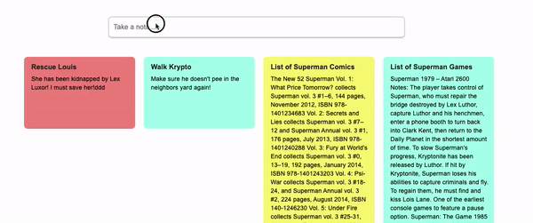

# Keep Clone - ~~Live Demo~~


Keep clone is an app that lets you create digital sticky notes! You can create, edit, and delete any 
number of memos you want to keep. You can even change their color!

## Technologies
1. Ruby on Rails
2. React
3. Redux
4. Javascript
5. PostgreSQL
6. Webpack
7. HTML
8. CSS
9. SCSS


## Features
**Create notes** 
+ Seamlessly create notes right on your note page
+ Intuitively save your notes by clicking the close button or simply clicking outside of the form
+ New notes are automatically added to the start of your list



**Edit notes**
+ Easily edit a note by clicking on it and see it open right there!
+ Save the note by simply closing it, again by using the button or clicking outside of the note
+ Change the colors of your note with a single click!


## Challenges

**Making the edit form a modal**


An especially challenging feature of the note edit function was getting it to open as a modal. In order for the modals state to persist, the onChange event listener had to be bounded to the modal and then threaded through the props until it could be invoked on the edit form. 

```javascript
<NoteShowContainer 
    note={modal.note}
    updateModalState={this.updateModalState} 
    setInitialModalState={this.setInitialModalState}
/>

<EditNoteContainer 
    updateModalState={this.props.updateModalState} 
    noteId={note.id}
/>
```

**Getting form to save multiple way**

Equally challenging was getting a note to act the same way both for closing the modal and for clicking the save button. Each feature had to have a different handleSubmit function because they were actually located at different parts in the program. 

```javascript
//For the modal
handleSubmit(e) {
    e.preventDefault();
    if (this.submittable()){
        this.props.updateNote(this.state)
            .then(this.closeModalAndPushToIndex) 
    }
}

//For the close button
handleSubmit(e) {
    e.preventDefault();
    const note = Object.assign({}, this.state);
    this.props.action(note)
        .then(() => this.props.fetchNotes())
    this.closeModalAndPushToIndex()
}
```

## Future features
+ Arrange notes with drag and drop
+ Add checkboxes to your notes to make todo lists
